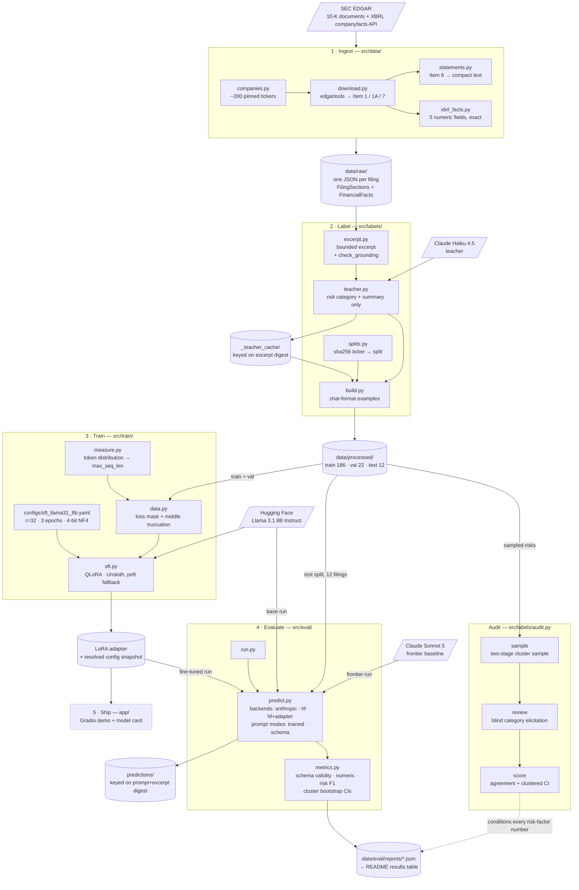

# Architecture

End-to-end flow from SEC filings to a scored extraction model. Every box is a module that exists in
the repo; every cylinder is an artifact on disk. Rationale for the labeled edges lives in
[`decisions.md`](decisions.md).

Dashed = not yet produced. As of the 2026-09-07 A100 run the adapter exists (pushed to the Hub;
`docs/runs/finetune.log`) and the fine-tuned eval rows are checked in under `data/eval/reports/`
(`docs/runs/fteval.log`); only the ship step -- demo and a written model card -- is still dashed.

## What the shape encodes

**Two sources of truth, deliberately split.** Numeric labels come from XBRL and cost nothing; only
risk categories and summaries reach a teacher model. That is the one paid edge in labeling, and it is
also the only edge whose output needs auditing — hence `audit.py` hanging off `data/processed/`
rather than off the numerics ([D2](decisions.md#d2--xbrl-companyfacts-as-programmatic-ground-truth-for-numerics),
[D3](decisions.md#d3--teacher-model-only-for-the-qualitative-half)).

**The excerpt is upstream of the teacher, not parallel to it.** `excerpt.py` runs first and
`teacher.py` labels *that text*, so every risk factor in a target is present in the input the student
sees ([D7](decisions.md#d7--the-teacher-labels-the-excerpt-not-the-full-filing)).

**Splitting happens before labeling, on the ticker.** `splits.py` feeds `build.py`, and assignment is
a hash of the ticker computed before fiscal year is known — so the test set's composition is a
property of the corpus, not a filter ([D5](decisions.md#d5--split-by-company-never-by-filing)).

**One scorer, three models.** `predict.py` returns raw text unmodified and `metrics.py` does all
parsing, so schema validity stays measurable and the base, fine-tuned, and frontier runs are scored
by identical code with no constrained decoding for anyone
([D16](decisions.md#d16--the-baseline-is-not-handicapped)).

**Both caches key on a content digest.** The teacher cache keys on the excerpt, the prediction cache
on prompt + excerpt. Changing the example format never re-pays for labeling; changing the scorer
never re-pays for generation. This is also why `refresh_facts.py` rewrites only the `financials`
block and leaves section text byte-identical ([D23](decisions.md#d23--teacher-labels-are-cached-per-filing)).
